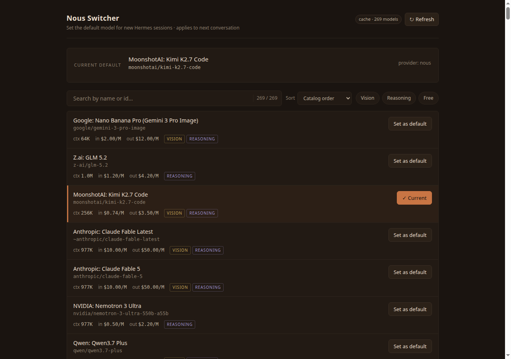

# Nous Switcher

A tiny local web app for browsing the Nous model catalog and setting the default model for new [Hermes Agent](https://github.com/NousResearch/hermes-agent) chats.

Built for our own Hermes setup first. Shared as an early alpha for other Hermes tinkerers who want a quick, local way to compare Nous models by price/context/capabilities and make one the default.

## Give this to your Hermes

Copy/paste this into a Hermes Agent session with terminal access:

```text
Please install and run the local Nous Switcher from https://github.com/hitoridito/hermes-nous-switcher.

First detect my OS, shell, Python, Git, Hermes install path, Hermes profile/home, and whether Hermes Desktop is running. Clone the repo into a sensible local tools directory, then read README.md and skills/hermes-nous-switcher/SKILL.md before acting.

Set it up safely for my platform. Keep it localhost-only. Do not print or store any tokens. Prefer a local venv if Hermes' own Python venv is not present. Start the app and tell me the local URL.

For the initial install check, do not call POST /api/set and do not modify my Hermes config. Verify only with safe read-only checks such as GET /api/health, GET /api/current, and GET /api/catalog. Wait for me to choose a model before writing config or applying a default.

If my OS or Hermes install layout is not supported, stop and explain the caveat instead of forcing Linux-specific paths. If my Hermes Desktop needs the fresh-new-chat default reseed patch for full no-Settings behavior, explain the caveat and ask before changing Desktop source.
```

If you prefer the Hermes CLI one-shot style:

```bash
hermes chat -q 'Please install and run the local Nous Switcher from https://github.com/hitoridito/hermes-nous-switcher. First detect my OS, shell, Python, Git, Hermes install path, Hermes profile/home, and whether Hermes Desktop is running. Clone the repo into a sensible local tools directory, then read README.md and skills/hermes-nous-switcher/SKILL.md before acting. Set it up safely for my platform. Keep it localhost-only. Do not print or store any tokens. Prefer a local venv if Hermes own Python venv is not present. Start the app and tell me the local URL. For the initial install check, do not call POST /api/set and do not modify my Hermes config. Verify only with safe read-only checks such as GET /api/health, GET /api/current, and GET /api/catalog. Wait for me to choose a model before writing config or applying a default. If my OS or Hermes install layout is not supported, stop and explain the caveat instead of forcing Linux-specific paths. If my Hermes Desktop needs the fresh-new-chat default reseed patch for full no-Settings behavior, explain the caveat and ask before changing Desktop source.'
```



## Platform support

Current state:

- **Linux + Hermes Desktop:** primary tested path.
- **Other Linux desktops:** expected to work for the local web app; Desktop Apply/fresh-chat behavior may vary.
- **macOS / Windows:** the FastAPI app and catalog/config writer may work with a normal Python venv, but the live Hermes Desktop Apply helper is currently Linux-focused because it discovers the dashboard process via `/proc`. On these systems, use this as an alpha and have Hermes explain the unsupported pieces before changing anything.

Windows first-contact note: Hermes Desktop may use `%LOCALAPPDATA%\hermes` as the active Hermes home/config path instead of `~/.hermes`. In one Windows test, `~/.hermes` existed but was stale, while the live config was under `%LOCALAPPDATA%\hermes`. Have Hermes detect this before starting the server.

### First-contact install notes

This is not a benchmark; it is provenance for the agent-native install path.

| Date | Host | Installing Hermes/model | Result |
|---|---|---|---|
| 2026-06-19 | Hermes Desktop on Windows 10 / MINGW64 bash | Minimax M3 (Medium) | Public repo cloned, README + skill read, local `.venv` created, app started at `127.0.0.1:9120`, `%LOCALAPPDATA%\hermes` correctly detected as active home, new sessions used the selected default after Hermes Settings → Apply. |

The app should fail soft: if live Desktop Apply is unavailable, it can still write config/catalog overlay and report a warning instead of crashing.

## Status

**Alpha / local utility.** It works in our setup, but it is intentionally small and boring:

- localhost only
- no hosted service
- no auth proxy
- no active-chat hot swap
- no telemetry

It changes the default model for **new Hermes chats**. It does not switch the model inside an already-running conversation.

## What it does

- Fetches the live Nous/OpenRouter-compatible model catalog from `https://inference-api.nousresearch.com/v1/models`.
- Caches the catalog at `~/.hermes/cache/nous_full_catalog.json` for fast loads and offline fallback.
- Shows model name, id, context length, input/output pricing per million tokens, and capability badges.
- Supports search, filters (`Vision`, `Reasoning`, `Free`), and sorting (`cheapest input`, `cheapest output`, `largest context`, `name`).
- Writes the selected model to `~/.hermes/config.yaml` as:

  ```yaml
  model:
    provider: nous
    default: <model-id>
  ```

- Writes a local Hermes model-catalog overlay so full-catalog Nous models can appear correctly in Hermes Settings/model picker even when they are outside Hermes' curated list.
- Calls the live Hermes Desktop backend's `POST /api/model/set` endpoint when Desktop is running, matching what Settings → Apply does.

## Important Hermes Desktop note

Hermes Desktop has had a sticky composer/new-chat model state that can override `config.yaml`. In our setup, fully removing the manual Settings → Apply step required a tiny Hermes Desktop patch: fresh new-chat drafts force-reseed from the global default (`refreshCurrentModel(true)`).

Without that patch, this tool can still update `config.yaml`, the catalog overlay, and the live backend default, but your Desktop UI may continue to use its previous composer model until you open Settings and click Apply.

See `skills/hermes-nous-switcher/SKILL.md` for the agent-readable explanation and caveats.

## Run locally

### Linux / macOS shell

From this directory:

```bash
./start.sh
```

Then open:

```text
http://127.0.0.1:9120
```

The launcher tries to reuse Hermes' own venv:

```text
~/.hermes/hermes-agent/venv/bin/python3
```

If that does not exist, create your own venv and install:

```bash
python3 -m venv .venv
. .venv/bin/activate
python -m pip install -r requirements.txt
python server.py
```

### Windows PowerShell

```powershell
.\start.ps1
```

Or manually:

```powershell
py -3 -m venv .venv
.\.venv\Scripts\Activate.ps1
python -m pip install -r requirements.txt
python server.py
```

Then open:

```text
http://127.0.0.1:9120
```

Windows support is alpha: catalog browsing and config writing may work, and a Windows first-contact test confirmed that new Hermes sessions picked up the selected default after opening Hermes Settings → Apply once. The live Desktop Apply helper is still Linux-focused until a Windows dashboard discovery path is added.

Hermes Desktop on Windows may visually update the model pill/current-chat display after Settings → Apply even for an existing chat. Treat that as UI-only unless switching away and back confirms the session model actually changed; ongoing sessions may retain their original model while new sessions use the new default.


## Files

```text
nous_switcher/
├── server.py                   FastAPI app (localhost:9120)
├── catalog.py                  Nous /v1/models fetcher + disk cache
├── config_writer.py            Round-trip-safe config.yaml writer
├── hermes_catalog_overlay.py   Local catalog overlay writer
├── hermes_desktop_apply.py     Live Hermes Desktop Apply endpoint caller
├── static/index.html           Single-file vanilla JS UI
├── skills/hermes-nous-switcher/SKILL.md
├── start.sh                    Linux/macOS launcher
├── start.ps1                   Windows PowerShell launcher
└── README.md
```

## API

| Method | Path                         | Purpose |
|---:|---|---|
| `GET` | `/api/health` | version, paths, sanity check |
| `GET` | `/api/catalog` | cached/full model catalog |
| `GET` | `/api/catalog?refresh=true` | force live re-fetch |
| `GET` | `/api/current` | current Hermes `model:` config block |
| `POST` | `/api/set` | set default model; body: `{ "model_id": "...", "provider": "nous" }` |

## Safety / privacy

- Server binds only to `127.0.0.1`.
- CORS only allows localhost origins.
- No API keys are needed to fetch the public catalog.
- Config writes are atomic (`config.yaml.tmp` then `os.replace`).
- Each successful config write creates a timestamped backup next to `config.yaml`.
- The live Desktop Apply helper reads the ephemeral dashboard session token from the same-user local Hermes Desktop process and sends it only to the loopback dashboard endpoint. It is not logged, persisted, or returned by the API.

## Known caveats

- This is Linux/Hermes Desktop focused because that is what we use.
- Full no-Settings behavior currently depends on the Hermes Desktop fresh-new-chat default reseed patch described above.
- Active-session hot swap is deliberately out of scope. Mid-conversation model switching has prompt-cache/cost implications and should use Hermes' own session/gateway model-switch path when exposed cleanly.
- The model catalog is whatever Nous' public `/v1/models` endpoint returns at runtime.

## Why share it?

Because it became useful in our own Hermes house, and maybe it helps another Hermes user tinker a little faster too.

Not a product launch. Just a small "hei, vi er også her" from our corner of the workshop.
